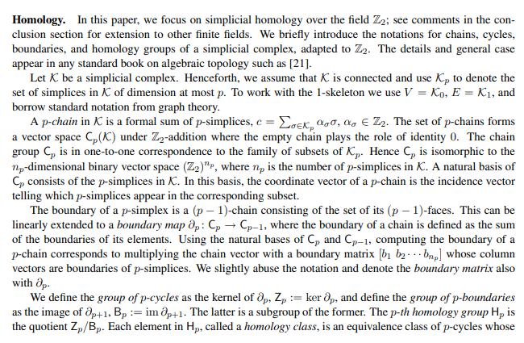
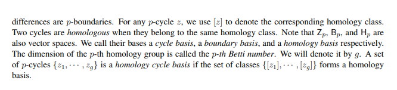

# 计算最短的 $H_1(\mathbb M; \Z_2)$ 生成元

https://boole.cs.qc.cuny.edu/cchen/publications/basis-SWAT.pdf

## 背景

> 上面说了 Simplicial homology 在 $ \Z_2 $ 下面来说 $ C_k $, $Z_k$, $B_k$ 和 $H_k$ 都是线性空间

## 算法步骤

输入是一个 Simplicial complex $ K$ 

记 $ n_0 $ 是顶点数目，$ n_1 $ 是边数目，$ n_2 $ 是面数目

1. 计算 $ \mathbb K $ 的 1-skeleton （记做 $\mathbb {K}_1$，也就是 K 的所有边和顶点的一个集合）的生成树 $ T$ ，则有如下结论：

   - 有 $ n_0 - 1 $ 条边在生成树上

   - 有 $ n_1 - n_0 + 1 $ 条边不在生成树上，记做 $\{\gamma(T, e_1), ..., \gamma(T, e_k)\}$

   不在生成树上的这些边构成了 $ Z_1(\mathbb K)$ 的一组基
   
2. 计算 $ B_1(\mathbb K)$ 

   考虑 $ \Z_2 $ 下的边界算子 $ \partial_2(p_0p_1p_2) = (p_0p_1) + (p_1p_2) + (p_2p_0) $

   则 $ B_1(\mathbb K) $ 的一组基张成了如下矩阵的列空间（其中 $ F_i $ 为 $ \mathbb K$ 的第 i 个面）：
   $$
   \left[
   \begin{array}{c|c|c}
   \partial_2(F_0) & \partial_2(F_1) & ... & \partial_2(F_{n_2})
   \end{array}
   \right]
   $$
   则利用行变换即可得到这样的基。此时，$ B_1(\mathbb K) $ 可以如下表示：
   $$
   B_1(\mathbb{K}) = \left[
   \begin{array}{c|c|c}
   \partial_2(F_{i_1}) & \partial_2(F_{i_2}) & ... & \partial_2(F_{i_n})
   \end{array}
   \right]
   $$
   其中 $ \partial_2(F_{i}) $ 需要满足任意组合线性无关。

3. 计算 $ H_1(\mathbb {K})$

   考虑到 $ H_1(\mathbb{K}) = Z_1(\mathbb{K}) / B_1(\mathbb{K}) $，那么只要计算
   $$
   \left[
   \begin{array}{c|c}
   B_1({\mathbb K}) & Z_1({\mathbb K})
   \end{array}
   \right]
   $$
   的一组基即可得到 $ H_1({\mathbb K}) $ 的基。这组作为基的列向量集合应该满足条件「」。

